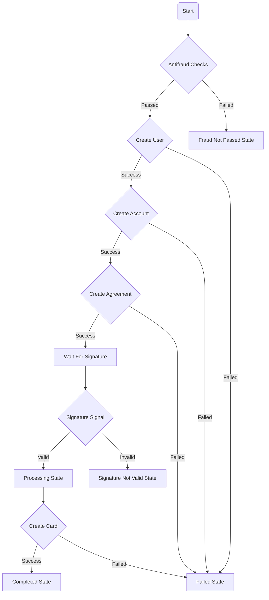

# Banking Onboarding

Set of services for onboarding new customers to a bank.
For more details find [My Medium article](https://medium.com)

### Prerequisites

- Go 1.22 or higher
- Docker (for running infrastructure components locally)

### Built with

- Go - The programming language used
- [Temporal](https://temporal.io/) - Workflow and activity orchestration framework
- Gin - HTTP web framework

### Components

- `environment` - contains docker-compose files for running infrastructure components locally.
- `onboarding-common` - contains common code like workflow and activities for `onboarding-service` and `onboarding-worker`.
- `onboarding-service` - contains the HTTP API for onboarding new customers.
- `onboarding-worker` - contains the worker for processing onboarding workflows.
- `stub-service` - contains a stub service for simulating other services.

### Onboarding flow

