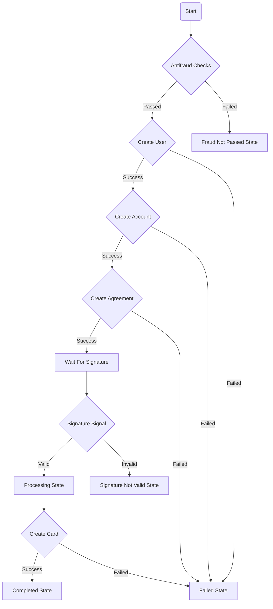

# Banking Onboarding

Set of services for onboarding new customers to a bank.
For more details find [My Medium article](https://medium.com)

### Prerequisites

- Go 1.22 or higher
- Docker (for running infrastructure components locally)

### Built with

- Go - The programming language used
- [Temporal](https://temporal.io/) - Workflow and activity orchestration framework
- Gin - HTTP web framework

### Components

- `environment` - contains docker-compose files for running infrastructure components locally.
- `onboarding-common` - contains common code like workflow and activities for `onboarding-service` and `onboarding-worker`.
- `onboarding-service` - contains the HTTP API for onboarding new customers.
- `onboarding-worker` - contains the worker for processing onboarding workflows.
- `stub-service` - contains a stub service for simulating other services.

### Onboarding flow steps

- Antifraud checks. Input: `first_name`, `last_name`, `city`, `email`. Output: `passed` (boolean value), `comment`.
- User entity creation. Input: `first_name`, `last_name`, `city`, `email`. Output: `id`, `first_name`, `last_name`, `city`, `email`.
- Bank account opening. Input: `user_id`, `type`, `currency`. Output: `id`, `user_id`, `currency`, `type`, `iban`, `balance`.
- Agreement generating. Input `user_id`, `account_id`. Output: `id`, `link_to_pdf_file`.
- Agreement signing. Input: `agreement_id`, `signature`. Output: `id`, `valid`, `comment`.
- Card opening. Input: `account_id`. Output: `id`, `account_id`, `number`, `expire`.

### Onboarding flow states
- `processing` - when the onboarding process is in progress and the client-side app should wait and display a progress bar.
- `failed` - when the onboarding process failed.
- `fraud_not_passed` - when the antifraud checks failed.
- `signature_not_valid` - when the signature is not valid.
- `waiting_for_agreement_signature` - when the agreement is generated and waiting for the signature, `onboarding-service` returns the link to the agreement PDF to the client-side app.
- `completed` - when the onboarding process is completed, `onboarding-service` returns the card's data.

### Onboarding flow

